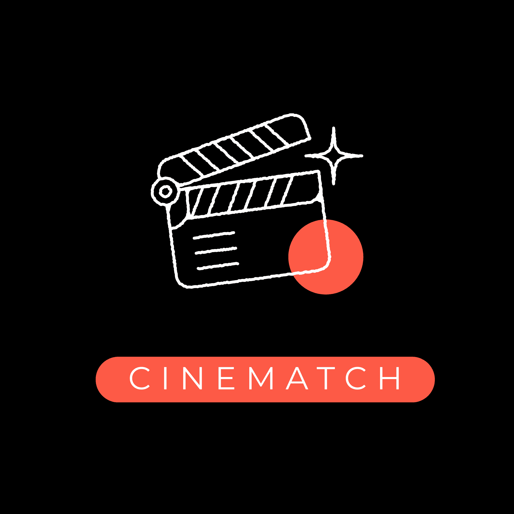

  

   
   

  <h1>🍿 CineMatch</h1>

  

    <strong>El "Tinder de las películas". Haz match y decide qué ver esta noche sin pelear.</strong>
  

  

    
    
    
    
    
  

  
  

    <em>Proyecto creado para la <b>Hackathon de Midudev</b> 🚀</em>
  

   

  

## 🎯 El Problema

Elegir una película con tu pareja o amigos suele terminar en un scroll infinito de 40 minutos por Netflix, para terminar viendo _The Office_ por quinta vez o yéndose a dormir sin ver nada. Hay demasiadas opciones, catálogos distintos y poner a todos de acuerdo es un drama.

## 💡 La Solución

**CineMatch** elimina la fricción de elegir qué ver convirtiéndolo en un juego colaborativo:

1. Creas una sala compartida en 2 clics.
2. Filtras por las plataformas que realmente pagan (Netflix, Prime, Disney+), el país y el género.
3. Compartes el link.
4. Deslizan películas estilo Tinder (♥️ o ❌).
5. **¡MATCH!** Cuando ambos le dan like a la misma película, la app les avisa en tiempo real.

---

## ☁️ Infraestructura: Despliegue en CubePath

Para cumplir con los estándares de producción de la hackathon, **CineMatch está alojado íntegramente en un VPS de CubePath**.

Aprovechando las herramientas integradas de la plataforma, utilicé la opción nativa de CubePath para inicializar **Dockploy** con un solo clic. Esta combinación perfecta me permitió:

- Automatizar el despliegue continuo de la aplicación (Next.js) en contenedores sin configuraciones complejas.
- Mantener la app rápida, estable y completamente aislada.
- Aprovechar la potencia del servidor en la nube para manejar las conexiones de WebSockets en tiempo real sin latencia.

---

## ✨ Experiencia de Usuario (UX/UI)

- **⚡ Cero Fricción:** No hay formularios de registro, ni logins pesados. Entras, creas y compartes.
- **📱 Mobile First:** Diseñado para sentirse como una app nativa en tu celular, con animaciones fluidas y gestos de _swipe_ intuitivos.
- **🌍 Catálogo Real:** Alimentado por **TMDB**, muestra exactamente lo que está disponible en tu región hoy mismo.

---

## 🛠️ Stack Tecnológico

El proyecto está construido priorizando la velocidad, el tiempo real y el diseño:

- **Frontend:** Next.js (App Router), React, Tailwind CSS.
- **Base de Datos & Realtime:** Supabase (PostgreSQL, Realtime WebSockets para la sincronización de los Matches).
- **Consumo de Datos:** The Movie Database (TMDB) API.
- **Despliegue (DevOps):** VPS de **CubePath** gestionado mediante contenedores con **Dockploy**.
- **Optimización:** Uso estratégico de caché (`sessionStorage`) para minimizar peticiones a la API y acelerar la carga de la interfaz.

---

## 📸 Demo en Acción

<video src="public/cinematch-demo.mov" autoplay muted loop width="100%" alt="Demo de CineMatch">
</video>

---

  <i>Diseñado y desarrollado para resolver peleas de fin de semana. 🍿</i>

